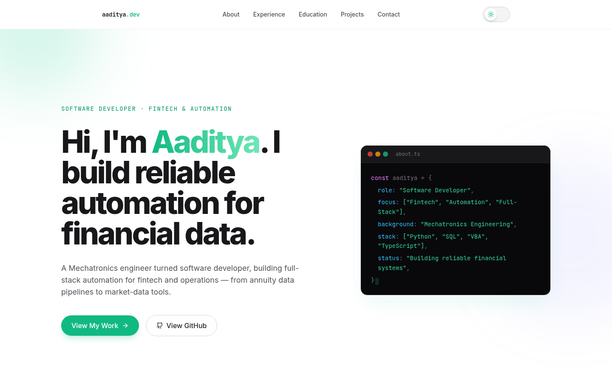

# Aaditya — Personal Portfolio

A personal portfolio site built with Next.js 14 (App Router, TypeScript), Tailwind CSS, and Framer Motion.



## Stack

- **Framework:** Next.js 14 (App Router)
- **Styling:** Tailwind CSS (dark-mode-first, emerald accent with secondary sky/amber/fuchsia accents)
- **Animation:** Framer Motion
- **Content:** Local JSON in `/data` (`projects.json`, `experience.json`, `education.json`)

## Getting Started

```bash
npm install
npm run dev
```

Open [http://localhost:3000](http://localhost:3000).

## Structure

```
/app
  layout.tsx              root layout, fonts, theme init script
  page.tsx                composes all sections
  globals.css             Tailwind layers, scrollbar/selection styling
/components
  /Aaditya                hero section (headline, CTAs, code-card visual)
  /About                  bio + "Beyond the Code" interests grid
  /Experience              work-history timeline
  /Education               education timeline (split from Experience)
  /Timeline                shared TimelineCard used by Experience & Education
  /Projects                filterable project grid + ProjectCard
  /Contact                 floating icon links (email, LinkedIn, GitHub)
  /Nav                     sticky header, desktop nav + mobile hamburger menu
  /ThemeToggle             animated light/dark switch
/data
  projects.json           project entries (title, tags, tech, links)
  experience.json         work history entries
  education.json          education entries
/lib
  ThemeContext.tsx        theme provider/context (localStorage + system pref)
  config.ts               shared social links (GitHub, LinkedIn, email)
  colors.ts               tag/accent color maps for project tags & timeline types
  filterProjects.ts       project tag filter logic + filter list
  types.ts                shared TypeScript interfaces
```

## Editing Content

Update `/data/projects.json`, `/data/experience.json`, and `/data/education.json` — no component code changes required. Social links live in `/lib/config.ts`.

## Development Notes

- Sections use `scroll-mt-24` to clear the sticky header on anchor navigation.
- The mobile nav panel is positioned as an absolute overlay (not in-flow) so it doesn't interfere with anchor scrolling.
- Theme choice persists to `localStorage` and falls back to `prefers-color-scheme` on first load, with an inline script in `layout.tsx` to avoid a flash of the wrong theme.
